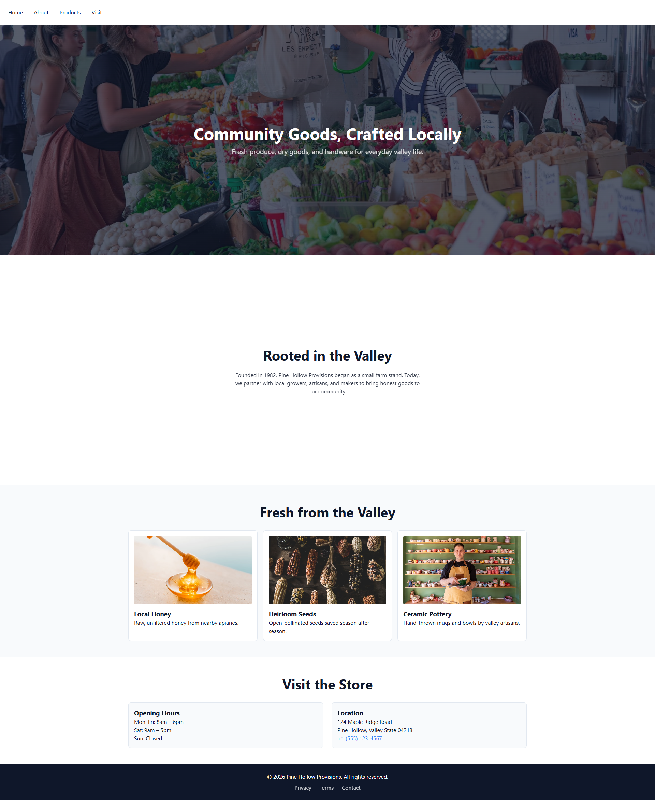

# Pine Hollow Provisions

A responsive, accessible static website for a fictional small-town general store. Built as a portfolio demonstration of modern front-end practices.

## 🌐 Live Demo
[View on Netlify](https://pine-hollow-provisions.netlify.app)

## 🛠️ Tech Stack
- Semantic HTML5
- Mobile-first CSS (Flexbox, Grid, `clamp()`, custom properties)
- Accessible markup & keyboard navigation
- Optimized images (WebP/AVIF via Squoosh)
- Deployed via Netlify

## 📐 Architecture Decisions
- **Mobile-first cascade**: Base styles target `320px+`. Breakpoints are content-driven, not device-specific.
- **Fluid typography**: `clamp()` eliminates jarring font-size jumps across viewports.
- **No frameworks**: Pure HTML/CSS to demonstrate foundational mastery before layering tools.

## ✨ Key Features
- ✅ Fully responsive layout (320px → 4K) with content-driven breakpoints
- ✅ WCAG-aligned accessibility: skip links, `:focus-visible`, semantic landmarks
- ✅ Fluid typography with `clamp()`—no jarring font jumps
- ✅ CSS Grid (`auto-fit`/`minmax`) for responsive cards without media queries
- ✅ Optimized images (WebP, lazy loading, explicit dimensions)

## 🚀 Local Development
1. Clone: `git clone https://github.com/naomansaeed/pine-hollow-provisions.git`
2. Open `index.html` in any modern browser
3. Use browser DevTools → Device Toolbar to test responsive behavior

## 📜 License
MIT © Naoman Saeed
